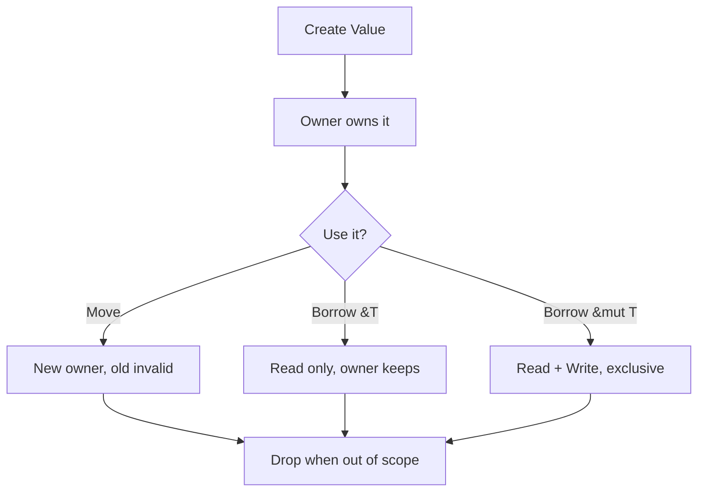

# Rust for TypeScript Developers

เรียนรู้ Rust อย่างเป็นระบบสำหรับ TypeScript Developer

<div class="abs-br m-6 text-xl opacity-50">
  2026
</div>

---
layout: section
---

# ทำไมต้อง Rust?

---

# Rust vs TypeScript

| Feature | TypeScript | Rust |
|---------|-----------|------|
| Memory | GC | Ownership + Borrowing |
| Null safety | `undefined`/`null` | `Option<T>` |
| Error handling | `try/catch` | `Result<T, E>` + `?` |
| Interfaces | `interface` | `trait` |
| Async | built-in event loop | `tokio` runtime |
| Immutability | `const`/`let` | `let` (default), `let mut` |
| Package manager | `bun`/`npm` | `cargo` |
| Linter | `biome` | `clippy` |
| Formatter | `biome format` | `rustfmt` |

{.table}

---
layout: section
---

# Ownership & Borrowing

---

# Ownership Rules

<v-clicks>

- ทุก value มี **owner** คนเดียว
- เมื่อ owner ออกจาก scope ค่าจะถูก **drop**
- สามารถ **move** ownership ได้ครั้งเดียว
- หรือ **borrow** โดยไม่ย้าย ownership

</v-clicks>

---
layout: two-cols
---

# Borrowing

ยืมค่าโดยไม่ย้าย ownership:

```rust {all|2|5|all} [borrow.rs]
// immutable borrow (&T)
fn calc_len(s: &String) -> usize {
    s.len()
} // s ถูกคืน ไม่ถูก drop

let s1 = String::from("hello");
let len = calc_len(&s1); // ยืม
println!("{}, {}", s1, len); // s1 ยงใช้ได้
```

::right::

# Mutable Borrow

ยืมและแก้ไขได้:

```rust {all|2|all} [mut_borrow.rs]
// mutable borrow (&mut T)
fn push_val(s: &mut String) {
    s.push_str(" world");
}

let mut s1 = String::from("hello");
push_val(&mut s1);
println!("{}", s1); // hello world
```

<v-click>

**กฎ**: 1 mutable **หรือ** N immutable ไม่มีทั้งคู่พร้อมกัน

</v-click>

---

# Ownership Flow



---
layout: section
---

# Error Handling

---

# Result + ? Operator

```rust {all|1-4|6-10|all} [error.rs]
use thiserror::Error;

#[derive(Error, Debug)]
pub enum AppError {
    #[error("not found: {0}")]
    NotFound(String),
    #[error("db error: {0}")]
    Database(#[from] sqlx::Error),
}

// Library: ใช้ thiserror
fn find_user(id: u64) -> Result<User, AppError> {
    let row = db.query(id)?; // ? = early return on Err
    Ok(row)
}

// Application: ใช้ anyhow + .context()
fn main() -> anyhow::Result<()> {
    let user = find_user(1)
        .context("failed to load user")?;
    Ok(())
}
```

<v-click>

> **Rule**: `thiserror` สำหรับ libraries, `anyhow` สำหรับ applications

</v-click>

---
layout: fact
---

# ไม่มี try/catch

Rust บังคับให้ handle error ทุกจุด

`Result<T, E>` + `?` = **compile-time safety**

---
layout: section
---

# Traits

---

# Traits = Interfaces (แต่ทรงพลังกว่า)

```rust {all|1-3|5-7|9-12|all} [traits.rs]
trait Drawable {
    fn draw(&self);
}

struct Circle { radius: f64 }

impl Drawable for Circle {
    fn draw(&self) {
        println!("circle r={}", self.radius);
    }
}

// Trait objects (dynamic dispatch)
fn render(item: &dyn Drawable) {
    item.draw();
}
```

<v-click>

TS `interface` = เฉพาะ shape | Rust `trait` = shape + default impl + associated types

</v-click>

---
layout: section
---

# Async/Await

---

# Async ต้องมี Runtime

```rust {all|1|3-5|7-13|all} [async.rs]
#[tokio::main]
async fn main() {
    let data = fetch_data().await?;
}

async fn fetch_data() -> Result<Data, Error> {
    // offload blocking work!
    let result = tokio::task::spawn_blocking(|| {
        heavy_computation()
    }).await?;
    Ok(result)
}
```

<v-clicks>

- TS: event loop built-in | Rust: ต้องมี `tokio` runtime
- **อย่าทำ blocking work ใน async** ใช้ `spawn_blocking`
- `async fn` คืน `Future` ต้อง `.await` ถึงจะทำงาน

</v-clicks>

---
layout: section
---

# Pattern Matching

---

# Match > Switch

```rust {all|1-5|7-9|11-13|all} [match.rs]
match result {
    Ok(user) => println!("found: {}", user.name),
    Err(AppError::NotFound(id)) => println!("missing: {}", id),
    Err(e) => println!("error: {}", e),
}

// Destructuring
let Point { x, y } = point;

// if let (short match)
if let Some(val) = option {
    println!("{}", val);
}
```

<v-click>

Rust `match` = **exhaustive** ต้อง cover ทุก case ไม่งั้น compile error

</v-click>

---
layout: section
---

# Ecosystem

---

# Tool Equivalents

| Tool | สำหรับ | เทียบเท่า TS |
|------|--------|-------------|
| `cargo` | Package manager + build | `bun` |
| `crates.io` | Package registry | `npmjs.com` |
| `rustc` | Compiler | `tsc` |
| `clippy` | Linter | `biome` |
| `rustfmt` | Formatter | `biome format` |
| `rust-analyzer` | LSP | `tsserver` |
| `tokio` | Async runtime | Node event loop |
| `serde` | Serialization | `zod` |
| `thiserror` | Library errors | custom Error classes |
| `anyhow` | App errors | `Error` + context |
| `proptest` | Property testing | `fast-check` |
| `nextest` | Test runner | `vitest` |

---
layout: section
---

# Best Practices 2026

---

# Production Best Practices

<v-clicks>

- ใช้ **Rust 2024 Edition** (1.85+) — async closures, precise lifetimes
- **`thiserror` สำหรับ libraries, `anyhow` สำหรับ apps**
- หลีกเลี่ยง `.unwrap()` ใน production — ใช้ `?` หรือ `expect()` พร้อม message
- หลีกเลี่ยง `.clone()` ไม่จำเป็น — บ่อยครั้งแปลว่าโครงสร้างผิด
- Offload blocking work — ใช้ `tokio::task::spawn_blocking`
- Zero-copy deserialization — ใช้ `rkyv` สำหรับ high-throughput
- Property-based testing — ใช้ `proptest`
- `cargo nextest` — เร็วกว่า `cargo test` มาก
- Clippy + rustfmt — รันเสมอ เหมือน biome ใน TS

</v-clicks>

---
layout: section
---

# แหล่งเรียนรู้

---

# Resources

<v-clicks>

- **The Rust Book** — https://doc.rust-lang.org/book/
- **Rust by Example** — https://doc.rust-lang.org/rust-by-example/
- **Effective Rust** — https://www.effective-rust.com/
- **Rustlings** — https://github.com/rust-lang/rustlings
- **Tokio Tutorial** — https://tokio.rs/tokio/tutorial
- **Cargo Book** — https://doc.rust-lang.org/cargo/

</v-clicks>

---
layout: end
---

# ขอบคุณ

สรุป: Rust = Safety + Performance โดยไม่มี GC

เริ่มต้น: Rustlings → The Book → Tokio Tutorial
