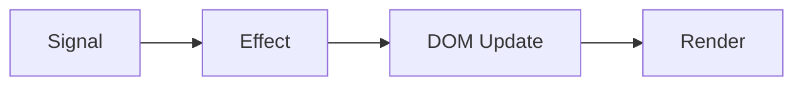

# SolidJS

Declarative JavaScript library with fine-grained reactivity, no virtual DOM, and compile-time optimization

<div @click="$slidev.nav.next" class="mt-12 py-1" hover:bg="white op-10">
  Press Space for next page <carbon:arrow-right />
</div>

<div class="abs-br m-6 text-xl">
  <a href="https://solidjs.com" target="_blank" class="slidev-icon-btn">
    <carbon:link />
  </a>
  <a href="https://github.com/solidjs/solid" target="_blank" class="slidev-icon-btn">
    <carbon:logo-github />
  </a>
</div>
--->

---
transition: fade-out
---

# What is SolidJS?

SolidJS is a declarative JavaScript library for building reactive user interfaces

- 🎯 **Fine-grained Reactivity** - updates only what changes
- ⚡ **No Virtual DOM** - direct DOM manipulation
- 🚀 **Compile-time Optimization** - minimal runtime overhead
- 📦 **Small Bundle Size** - ~6KB gzipped
- 🧑‍💻 **Developer Friendly** - simple and intuitive API
<br>
<br>

Read more at [solidjs.com](https://solidjs.com)

---
transition: slide-up
level: 2
---

# Key Concepts

## Signals

Signals are the core of SolidJS reactivity

```ts
import { createSignal } from 'solid-js'

const [count, setCount] = createSignal(0)

// Read signal
console.log(count()) // 0

// Update signal
setCount(1)
console.log(count()) // 1
```

## Effects

Effects run when signals change

```ts
import { createEffect } from 'solid-js'

createEffect(() => {
  console.log('Count changed:', count())
})
```

---
layout: two-cols
layoutClass: gap-16
---

# Table of Contents

<Toc minDepth="1" maxDepth="2" />

::right::

## Topics Covered

- Installation & Setup
- Key Concepts (Signals, Effects, Components)
- Reactivity Model
- Performance Optimization
- Best Practices
- Integration & Deployment

---
layout: image-right
image: https://source.unsplash.com/collection/94734566/slidev
---

# Installation

Install SolidJS with Bun

```bash
bun add solid-js
```

## Quick Start

```tsx
import { createSignal } from 'solid-js'
import { render } from 'solid-js/web'

function Counter() {
  const [count, setCount] = createSignal(0)

  return (
    <button onClick={() => setCount(c => c + 1)}>
      {count()}
    </button>
  )
}

render(() => <Counter />, document.getElementById('app'))
```

---
level: 2
---

# Reactivity Model

SolidJS uses fine-grained reactivity without virtual DOM

## How It Works

1. **Signals** track dependencies automatically
2. **Effects** subscribe to signals and re-run on changes
3. **Direct DOM updates** - no diffing needed
4. **Compile-time optimization** - minimal runtime



---
layout: center
class: text-center
---

# Components

Components are functions that return JSX

```tsx
function App() {
  const [name, setName] = createSignal('SolidJS')

  return (
    <div>
      <h1>Hello, {name()}!</h1>
      <input 
        value={name()} 
        onInput={(e) => setName(e.currentTarget.value)}
      />
    </div>
  )
}
```

---
class: px-20
---

# Performance

SolidJS is highly performant due to its architecture

## Key Performance Features

- **No Virtual DOM** - direct DOM manipulation
- **Fine-grained updates** - only changed nodes update
- **Compile-time optimization** - minimal runtime
- **Small bundle size** - ~6KB gzipped
- **Fast initial render** - no hydration needed

<div grid="~ cols-2 gap-4" m="t-4">

```ts
// Efficient reactivity
const [count, setCount] = createSignal(0)

// Only this element updates
<div>{count()}</div>
```

```ts
// Batch updates
import { batch } from 'solid-js'

batch(() => {
  setCount(1)
  setName('test')
})
```

</div>

---
transition: slide-left
---

# Best Practices

## Use Signals for State

```tsx
// ✅ Good
const [count, setCount] = createSignal(0)

// ❌ Bad - avoid reactivity overhead
const count = { value: 0 }
```

## Use Effects for Side Effects

```tsx
// ✅ Good
createEffect(() => {
  document.title = `Count: ${count()}`
})

// ❌ Bad - effects in render
function App() {
  document.title = `Count: ${count()}`
  return <div>{count()}</div>
}
```

---
transition: fade-in
---

# Integration

SolidJS integrates with various tools and frameworks

## Supported Integrations

- **Vite** - modern build tool
- **TypeScript** - full type safety
- **Tailwind CSS** - utility-first styling
- **Solid Router** - client-side routing
- **Solid Start** - full-stack framework

```bash
# Create new project
bun create solid my-app
cd my-app
bun install
bun dev
```

---
layout: center
class: text-center
---

# Learn More

[SolidJS Documentation](https://solidjs.com) · [GitHub](https://github.com/solidjs/solid) · [Examples](https://solidjs.com/examples)

<div class="mt-10">
  <span class="text-2xl">🚀 Start building with SolidJS today!</span>
</div>
